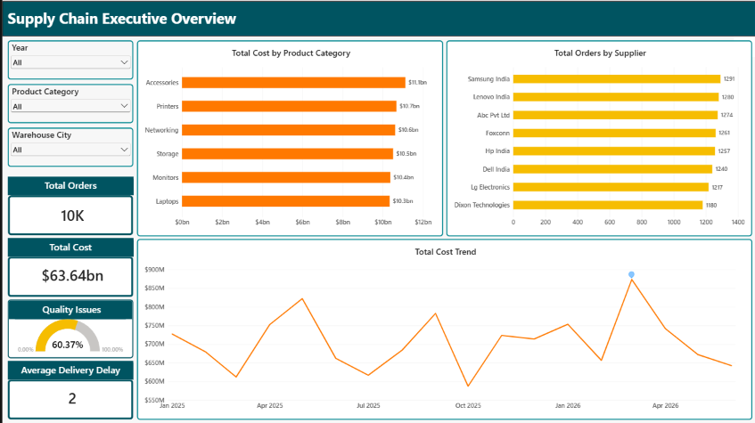
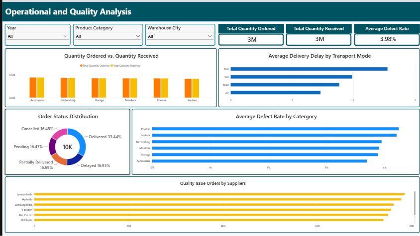

# Supply Chain Medallion Data Platform on AWS

## Overview

An end-to-end supply chain analytics data platform built using AWS
serverless data engineering services and a Medallion Architecture.

The platform ingests raw supply chain data, performs data quality
validation and transformation, creates a dimensional Gold layer,
and exposes business metrics through Power BI.

## Project Outcome

Built an event-driven AWS supply chain data platform capable of
transforming raw operational data into analytics-ready Gold datasets.
Visualized the data into Power BI report.

### Report

#### Executive Overview

#### Operational & Quality Analysis

The pipeline implements:

Raw → Bronze → Silver → Gold

with automated orchestration between Silver and Gold using
Amazon EventBridge and AWS Glue Workflow.

## Architecture

Raw Excel
→ Amazon S3 Bronze
→ AWS Lambda
→ AWS Glue Silver ETL
→ Amazon EventBridge
→ AWS Glue Workflow
→ Gold Fact / Dimensions / Aggregations
→ Power BI

## Technology Stack

- Amazon S3
- AWS Lambda
- AWS Glue
- Amazon EventBridge
- AWS Glue Workflow
- Python
- Pandas
- PySpark
- Parquet
- Power BI
- DAX

## Data Architecture

### Bronze

Stores the original raw supply chain dataset.

### Silver

The Silver ETL performs:

- Data type standardization
- Missing-value handling
- Date validation
- Numeric validation
- Referential checks
- Quality issue identification
- Delivery delay calculation
- Lead-time calculation
- Procurement cost calculation
- Total cost calculation

### Gold

The Gold layer contains:

#### Dimensions

- dim_date
- dim_supplier
- dim_product
- dim_warehouse

#### Fact

- fact_procurement

#### Aggregations

- agg_monthly_procurement
- agg_supplier_performance
- agg_transport_performance
- agg_warehouse_performance

## Orchestration

The pipeline is event-driven.

When the Silver Glue job completes successfully,
Amazon EventBridge detects the Glue Job State Change event
and triggers the Gold Glue Workflow.

The workflow executes the Gold transformation jobs.

## Data Quality

The pipeline performs validation checks including:

- Quantity validation
- Unit-cost validation
- Shipping-cost validation
- Date validation
- Supplier existence
- Product existence
- Warehouse existence
- Delivery delay validation
- Inspection validation
- Defect mismatch validation

Referential integrity between the Silver fact data and
Gold dimensions was validated successfully.

## Power BI

The Gold data is consumed by Power BI for:

### Executive Overview

- Total Orders
- Total Cost
- Average Delivery Delay
- Quality Issue %
- Procurement Spend by Category
- Order Volume by Supplier
- Procurement Cost Trend

### Operational & Quality Analysis

- Ordered vs Received Quantity
- Delivery Delay by Transport Mode
- Defect Rate by Category
- Quality Issues by Supplier
- Order Status Distribution

## Key Business Questions

The dashboard enables analysis of:

- Which categories drive procurement spend?
- Which suppliers handle the highest order volumes?
- Which transport modes experience greater delays?
- Which categories have higher defect rates?
- Which suppliers generate more quality issues?
- How does procurement spending change over time?

## Key Engineering Concepts Demonstrated

- Medallion Architecture
- ETL
- Data Quality
- Dimensional Modeling
- Star Schema
- Fact and Dimension Tables
- Event-driven orchestration
- AWS Glue Workflows
- Serverless AWS architecture
- Parquet data format
- Data aggregation
- Power BI semantic modeling
- DAX measures

## Future Improvements

- Amazon Athena as a SQL serving layer
- Automated Power BI refresh
- Incremental processing
- Data cataloging with AWS Glue Data Catalog
- CI/CD
- Infrastructure as Code
- Real-time ingestion using Kafka
